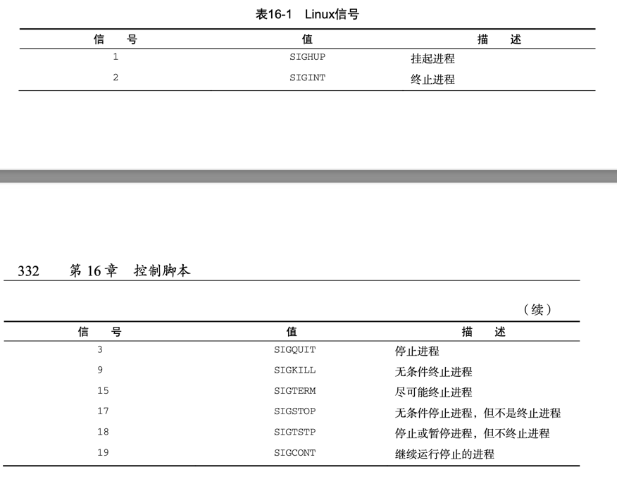

# 16.1 处理信号
### 16.1.1 重温Linux信号
- 默认情况下，bash shell会忽略收到的任何SIGQUIT (3)和SIGTERM (15)信号(正因为这样， 交互式shell才不会被意外终止)。但是bash shell会处理收到的SIGHUP (1)和SIGINT (2)信号。
- 

### 16.1.2 生成信号
- 1. 中断进程
    - Ctrl+C组合键会生成SIGINT信号，并将其发送给当前在shell中运行的所有进程
    - sleep 100 // ctrl + c
- 2. 暂停进程
    - Ctrl+Z组合键会生成一个SIGTSTP信号，停止shell中运行的任何进程
    - sleep 100 // ctrl + z , 状态为T
    ```shell
    ps aux | grep sleep
    yuzhongyu        99593   0.0  0.0 407963472    480 s012  R+    5:52PM   0:00.00 grep --color=auto sleep
    yuzhongyu        99586   0.0  0.0 408497248   1392 s012  T     5:52PM   0:00.00 sleep 100
    ```

### 16.1.3 捕获信号
- trap命令的格式是: trap commands signals
```shell
#!/bin/bash
# Testing signal trapping
#
trap "echo ' Sorry! I have trapped Ctrl-C'" SIGINT 
#
echo This is a test script
#
count=1
while [ $count -le 10 ]
do
   echo "Loop #$count"
   sleep 1
   count=$[ $count + 1 ]
done
#
echo "This is the end of the test script"

```
- 每次使用Ctrl+C组合键，脚本都会执行trap命令中指定的echo语句，而不是处理该信号并
  允许shell停止该脚本

### 16.1.4 捕获脚本退出
```shell
#!/bin/bash
# Trapping the script exit #
trap "echo Goodbye..." EXIT 
#
count=1
while [ $count -le 5 ]
do
   echo "Loop #$count"
   sleep 1
   count=$[ $count + 1 ]
done

```
- 当脚本运行到正常的退出位置时，捕获就被触发了，shell会执行在trap命令行指定的命令。 如果提前退出脚本，同样能够捕获到EXIT

### 16.1.5 修改或移除捕获
- 修改捕获
```shell
#!/bin/bash
# Modifying a set trap
#
trap "echo ' Sorry... Ctrl-C is trapped.'" SIGINT 
#
count=1
while [ $count -le 5 ]
do
   echo "Loop #$count"
   sleep 1
   count=$[ $count + 1 ]
done
#
trap "echo ' I modified the trap!'" SIGINT
#
count=1
while [ $count -le 5 ]
do
   echo "Second Loop #$count"
   sleep 1
   count=$[ $count + 1 ]
done 
#

```
- 移除捕获
```shell
#!/bin/bash
# Removing a set trap
#
trap "echo ' Sorry... Ctrl-C is trapped.'" SIGINT 
#
count=1
while [ $count -le 5 ]
do
   echo "Loop #$count"
   sleep 1
   count=$[ $count + 1 ]
done
#
# Remove the trap
trap -- SIGINT
echo "I just removed the trap"
#
count=1
while [ $count -le 5 ]
do
   echo "Second Loop #$count"
   sleep 1
   count=$[ $count + 1 ]
done
# 
```

# 16.2 以后台模式运行脚本
### 16.2.1 后台运行脚本
```shell
#!/bin/bash
# Test running in the background 
# 
count=1
while [ $count -le 10 ]
do
sleep 1
   count=$[ $count + 1 ]
done
#
```
- 方括号中的数字是shell分配给后台进程的作业号。下一个数是Linux系统分配给进程的进程 ID(PID)
``` 
yuzhongyu@yuzhongyudeMacBook-Air chapter16_控制脚本 % ./test4.sh &
[1] 17146
yuzhongyu@yuzhongyudeMacBook-Air chapter16_控制脚本 %
[1]  + done       ./test4.sh
yuzhongyu@yuzhongyudeMacBook-Air chapter16_控制脚本 %
```
- 当后台进程运行时，它仍然会使用终端显示器来显示STDOUT和STDERR消息
```shell
#!/bin/bash
# Test running in the background with output 
# 
echo "Start the test script"
count=1
while [ $count -le 5 ]
do
   echo "Loop #$count"
   sleep 5
   count=$[ $count + 1 ]
done
#
echo "Test script is complete"

```
```
yuzhongyu@yuzhongyudeMacBook-Air chapter16_控制脚本 % ./test5.sh &
[1] 17431
yuzhongyu@yuzhongyudeMacBook-Air chapter16_控制脚本 % Start the test script
Loop #1
Loop #2
Loop #3
Loop #4
Loop #5
Test script is complete

[1]  + done       ./test5.sh

```

### 16.2.2 运行多个后台作业
- 在ps命令的输出中，每一个后台进程都和终端会话(pts/0)终端联系在一起。如果终端会话退出，那么后台进程也会随之退出

# 16.3 在非控制台下运行脚本
- nohup命令运行了另外一个命令来阻断所有发送给该进程的SIGHUP信号。这会在退出终端会话时阻止进程退出
- 进程也就不再同STDOUT和STDERR联系在一起, nohup命令会自动将STDOUT和STDERR的消息重定向到一个名为 nohup.out的文件中
```shell
nohup ./test5.sh &
```

# 16.4 作业控制
### 16.4.1 查看作业
- $$ 变量来显示Linux系统分配给该脚本的PID
```shell
#!/bin/bash
# Test job control
#
echo "Script Process ID: $$" #
count=1
while [ $count -le 10 ]
do
   echo "Loop #$count"
   sleep 10
   count=$[ $count + 1 ]
done
#
echo "End of script..."
#

```

```
yuzhongyu@yuzhongyudeMacBook-Air chapter16_控制脚本 % ./test10.sh 
Script Process ID: 24322
Loop #1
^Z
zsh: suspended  ./test10.sh

yuzhongyu@yuzhongyudeMacBook-Air chapter16_控制脚本 % nohup ./test10.sh > test10.out &
[2] 24343
yuzhongyu@yuzhongyudeMacBook-Air chapter16_控制脚本 % jobs
[1]  + suspended  ./test10.sh
[2]  - running    nohup ./test10.sh > test10.out
yuzhongyu@yuzhongyudeMacBook-Air chapter16_控制脚本 % jobs -l
[1]  + 24322 suspended  ./test10.sh
[2]  - 24343 running    nohup ./test10.sh > test10.out

```
- 带+ 号的作业会被当做默认作业

### 16.4.2 重启停止的作业
- bg 命令, 后台模式重启作业
  - bg 恢复默认作业
  - bg 2 恢复作业号作业   // centos 可以, mac 不行
  - Ctrl+Z组合键挂起正在运行的前台进程，然后用bg命令将 其置入后台模式
- fg 命令, 前台模式重启作业
  - fg 2

# 16.5 调整谦让度
### 16.5.1 nice命令
### 16.5.2 renice命令

# 16.6 定时运行作业
### 16.6.1 用at命令来计划执行作业
- at [-f filename] time
  - 显示器不关联 STDOUT和STDERR
```
yuzhongyu@yuzhongyudeMacBook-Air chapter16_控制脚本 % at -f test13.sh now
job 1 at Wed Jun  1 17:50:36 2022

```
- 列出等待的作业
  - atq
- 删除作业
  - atrm 1 (作业号)

### 16.6.2 安排需要定期执行的脚本
- crontab testing_crontab
- crontab -l  // 列表
- crontab -r  // 删除

### 16.6.3 使用新shell启动脚本
```
$HOME/.bash_profile
$HOME/.bash_login
$HOME/.profile
.bashrc
```

