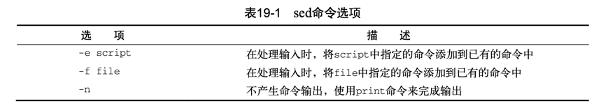
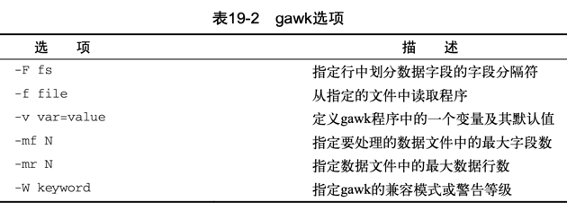

# 19.1 文本处理
### 19.1.1 sed 编辑器
- sed 执行操作
  - 一次从输入中读取一行数据。
  - 根据所提供的编辑器命令匹配数据。
  - 按照命令修改流中的数据。
  - 将新的数据输出到STDOUT。
- sed options script file
    - 
- 在命令行定义编辑器命令
  - echo "This is a test" | sed 's/test/big test/'
      - s命令会用斜线间指定的第二个文本字符串来替换第 一个文本字符串
  - sed 's/dog/cat/' data1.txt
- 在命令行使用多个编辑器命令
  - sed -e 's/brown/green/; s/dog/cat/' data1.txt
  - 多命令不使用分号;
    ```shell
    $sed -e '
    > s/brown/green/
    > s/fox/elephant/
    > s/dog/cat/' data1.txt
    ```
- 从文件中读取编辑器命令
    - sed -f script1.sed data1.txt

### 19.1.2 gawk 程序 (awk)
- gawk命令格式
    - gawk options program file
    - 
- 从命令行读取程序脚本
    - awk '{print "Hello World!"}'
    - 跟sed编辑器一样，gawk程序会针对数据流中的每行文本执行程序脚本
    - Ctrl+D组合键会在bash中产生一个EOF字符。这个组合键能够终止该gawk 程序并返回到命令行界面提示符下
- 使用数据字段变量
    - awk自动给一行中的每个数据元素分配一个变量。默认情况下，gawk会将如下变量分配给它在文本行中发现的数据字段:
        - $0代表整个文本行;
        - $1代表文本行中的第1个数据字段; 
        - $2代表文本行中的第2个数据字段; 
        - $n代表文本行中的第n个数据字段。
    - 在文本行中，每个数据字段都是通过字段分隔符划分的
        - awk中默认的字段分隔符是任意的空白字符(例如空格或制表符)
        - awk '{print $1}' data2.txt
    - 要采其他字段分隔符的文件，可以用-F选项指定
        -  awk -F: '{print $1}' /etc/passwd
- 在程序脚本中使用多个命令
    - echo "My name is Rich" | awk '{$4="Christine"; print $0}'
    - 也可以用次提示符一次一行地输入程序脚本命令
        ```shell
        $ gawk '{
        > $4="Christine"
        > print $0}'
        ```
        - Ctrl+D组合键来表明数据结束
- 从文件中读取程序
    - awk -F: -f script2.awk /etc/passwd
    - awk -F: -f script3.awk /etc/passwd  (文件中定义变量)
      ```shell
        {
        text = "'s home directory is "
        print $1 text $6
        }
      ```
- 在处理数据前运行脚本
    - awk 'BEGIN {print "Hello World!"}'
    - 多行命令
    ``` shell
    yuzhongyu@yuzhongyudeMacBook-Air chapter19_初识sed和gawk % awk 'BEGIN {print "The data3 File Contents:"}
    quote> {print $0}' data3.txt
    The data3 File Contents:
    Line 1
    Line 2
    Line 3
    ```
- 在处理数据后运行脚本
    ``` shell
     $ gawk 'BEGIN {print "The data3 File Contents:"} 
     > {print $0}
     > END {print "End of File"}' data3.txt
    ```
- demo
    - awk -f script4.gawk /etc/passwd
    ```shell
    BEGIN {
    print "The latest list of users and shells" 
    print " UserID \t Shell"
    print "-------- \t -------"
    FS=":"
    }
    
    { 
    print $1 "  \t"  $7 
    }
    
    END {
    print "This concludes the listing"
    }
    
    ```

# 19.2 sed 编辑器基础
### 19.2.1 更多的替换选项
1. 替换标记
    - s/pattern/replacement/flags
    - flags
       - 数字，表明新文本将替换第几处模式匹配的地方; 
       - g，表明新文本将会替换所有匹配的文本;
       - p，表明原先行的内容要打印出来;
       - w file，将替换的结果写到文件中。
    - sed 's/test/trial/2' data4.txt
    - sed 's/test/trial/g' data4.txt
    - sed -n 's/test/trial/p' data5.txt 
      - p替换标记会打印与替换命令中指定的模式匹配的行。这通常会和sed的-n选项一起使用
    - sed 's/test/trial/w test.txt' data5.txt
        - w标记, sed编辑器的正常输出是在STDOUT中，而只有那些包含匹配模式的行才会保存在指定的输出 文件中
2. 替换字符
    - sed 's/\/bin\/bash/\/bin\/csh/' /etc/passwd
        - 由于正斜线通常用作字符串分隔符，因而如果它出现在了模式文本中的话，必须用反斜线来转义
    - sed 's!/bin/bash!/bin/csh!' /etc/passwd
        - 功能同上

### 19.2.2 使用地址
1. 数字方式的行寻址
    - sed '2s/dog/cat/' data1.txt     (仅第二行替换)
    - sed '2,$s/dog/cat/' data1.txt   (从第二行开始替换)
2. 使用文本模式过滤器
    - sed '/Samantha/s/bash/csh/' /etc/passwd
3. 命令组合
```shell
$ sed '2{
> s/fox/elephant/
> s/dog/cat/
> }' data1.txt

$ sed '3,${
> s/brown/green/
> s/lazy/active/
> }' data1.txt
```

### 19.2.3 删除行
- sed '3d' data6.txt
- sed '2,3d' data6.txt
- sed '3,$d' data6.txt
- sed '/number 1/d' data6.txt

### 19.2.4 插入和附加文本
```shell
$ echo "Test Line 2" | sed 'i\Test Line 1' 
Test Line 1
Test Line 2

$ echo "Test Line 2" | sed 'a\Test Line 1' 
Test Line 2
Test Line 1

$ sed '3i\
> This is an inserted line.' data6.txt 
This is line number 1.
This is line number 2.
This is an inserted line.
This is line number 3.
This is line number 4.

$ sed '$a\
> This is a new line of text.' data6.txt 
This is line number 1.
This is line number 2.
This is line number 3.
This is line number 4.
This is a new line of text.
```

### 19.2.5 修改行
```shell
$ sed '3c\
> This is a changed line of text.' data6.txt 
This is line number 1.
This is line number 2.
This is a changed line of text.
This is line number 4.
```

### 19.2.6 转换命令
```shell

$ sed 'y/123/789/' data8.txt T
his is line number 7.
This is line number 8.
This is line number 9.
This is line number 4.
This is line number 7 again.
This is yet another line.
This is the last line in the file.
```

### 19.2.7 回顾打印
1. 打印行
```shell
$ sed -n '/number 3/p' data6.txt 
This is line number 3.
```
2. 打印行号
```shell
$ sed '=' data1.txt
1
The quick brown fox jumps over the lazy dog. 
2
The quick brown fox jumps over the lazy dog. 
3
The quick brown fox jumps over the lazy dog. 
4
The quick brown fox jumps over the lazy dog. 
$
```

### 19.2.8 使用sed处理文件
1. 写入文件
```shell
$ sed '1,2w test.txt' data6.txt 
This is line number 1.
This is line number 2.
This is line number 3.
This is line number 4. $
$ cat test.txt
This is line number 1. 
This is line number 2.


$ cat data11.txt
Blum, R Browncoat
McGuiness, A Alliance
Bresnahan, C Browncoat
Harken, C Alliance
$
$ sed -n '/Browncoat/w Browncoats.txt' data11.txt 
$
$ cat Browncoats.txt
Blum, R Browncoat
Bresnahan, C Browncoat
```

2. 从文件读取数据
```shell
$ cat data12.txt
This is an added line.
This is the second added line. 
$
$ sed '3r data12.txt' data6.txt 
This is line number 1.
This is line number 2.
This is line number 3.
This is an added line.
This is the second added line. 
This is line number 4.


$ sed '/LIST/{
> r data11.txt
>d
> }' notice.std
Would the following people:
Blum, R Browncoat
McGuiness, A Alliance
Bresnahan, C Browncoat
Harken, C Alliance
please report to the ship's captain. 
$
```
