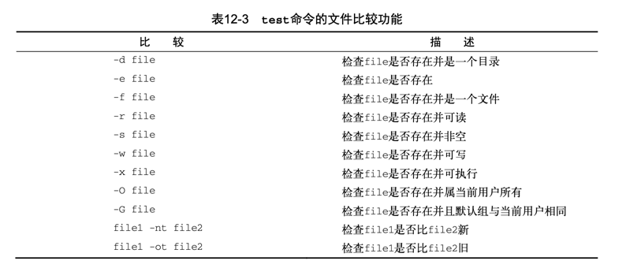

# 12.1 使用if-then语句
```shell
if command 
then
  commands
fi

或者

if command; then 
  commands
fi
```
- bash shell的if语句会运行if后面的那个命令。如果该命令的退出状态码是0 (该命令成功运行)，位于then部分的命令就会被执行

```shell
#!/bin/bash
# testing the if statement
if pwd
then
  echo "It worked"
fi


#!/bin/bash
# testing multiple commands in the then section #
testuser=Christine
#
if grep $testuser /etc/passwd
then
       echo "This is my first command"
       echo "This is my second command"
       echo "I can even put in other commands besides echo:"
       ls -a /home/$testuser/.b*
fi
```

# 12.2 if-then-else语句
```shell
if command 
then
  commands
else
  commands
fi
```

```shell
#!/bin/bash
# testing the else section
#
testuser=NoSuchUser
#
if grep $testuser /etc/passwd
then
   echo "The bash files for user $testuser are:"
   ls -a /home/$testuser/.b*
   echo
else
   echo "The user $testuser does not exist on this system."
   echo
fi

```

# 12.3 嵌套if
```shell
if command1 
then
  commands 
elif command2 
then
  commands 
fi
```

```shell
#!/bin/bash
# Testing nested ifs - use elif #
testuser=NoSuchUser
if grep $testuser /etc/passwd
then
   echo "The user $testuser exists on this system."
elif ls -d /home/$testuser
then
   echo "The user $testuser does not exist on this system."
   echo "However, $testuser has a directory."
fi

```

```shell
if command1 
then
  command set 1 
elif command2
then
  command set 2 
elif command3 
then
  command set 3 
elif command4 
then
  command set 4
fi
```

# 12.4 test命令
```shell
if test condition 
then
  commands
fi
```
- 如果不写test命令的condition部分，它会以非零的退出状态码退出，并执行else语句块

```shell
#!/bin/bash
# Testing the test command #
my_variable="Full"
#
if test $my_variable
then
   echo "The $my_variable expression returns a True"
#
else
   echo "The $my_variable expression returns a False"
fi
```

- bash shell提供了另一种条件测试方法，无需在if-then语句中声明test命令
```shell
if [ condition ] 
then
  commands
fi
```
- 注意，第一个方括号之后和第二个方括号之前必须加上一个空格

### 12.4.1 数值比较
- eq ge gt le lt ne
```shell
#!/bin/bash
# Using numeric test evaluations
#
value1=10
value2=11
#
if [ $value1 -gt 5 ]
then
    echo "The test value $value1 is greater than 5"
fi
#
if [ $value1 -eq $value2 ]
then
    echo "The values are equal"
else
    echo "The values are different"
fi
#

```
- 不能在test命令中使用浮点值

### 12.4.2 字符串比较
- str1 = str2
- str1 != str2
- str1 < str2 // 检查str1是否比str2小
- str1 > str2 // 检查str1是否比str2大
- -n str1 // 检查str1的长度是否非0
- -z str1 // 检查str1的长度是否为0

```shell
#!/bin/bash
# testing string equality
testuser=baduser
#
if [ $USER != $testuser ]
then
   echo "This is not $testuser"
else
   echo "Welcome $testuser"
fi

```

```shell
#!/bin/bash
# mis-using string comparisons
val1=baseball
val2=hockey
#
if [ $val1 \> $val2 ]
then
  echo "$val1 is greater than $val2"
else
   echo "$val1 is less than $val2"
fi

```


```shell
#!/bin/bash
# testing string length
val1=testing
val2=''
#
if [ -n $val1 ]
then
   echo "The string '$val1' is not empty"
else
   echo "The string '$val1' is empty"
fi
#
if [ -z $val2 ]
then
   echo "The string '$val2' is empty"
else
   echo "The string '$val2' is not empty"
fi
#
if [ -z $val3 ]
then
   echo "The string '$val3' is empty"
else
   echo "The string '$val3' is not empty"
fi

```

### 12.4.3 文件比较
- 
- 检查目录
```shell
#!/bin/bash
# Look before you leap
jump_directory=/home/arthur
if [ -d $jump_directory ]
then
   echo "The $jump_directory directory exists"
   cd $jump_directory
   ls
else
   echo "The $jump_directory directory does not exist"
fi

```
# 12.5 复合条件测试
- [ condition1 ] && [ condition2 ]
- [ condition1 ] || [ condition2 ]
```shell
#!/bin/bash
# testing compound comparisons
#
if [ -d $HOME ] && [ -w $HOME/testing ]
then
   echo "The file exists and you can write to it"
else
   echo "I cannot write to the file"
fi

```

# 12.6 if-then的高级特性
### 12.6.1 使用双括号
- (( expression ))
- 
```shell
#!/bin/bash
# using double parenthesis #
val1=10
#
if (( $val1 ** 2 > 90 ))
then
   (( val2 = $val1 ** 2 ))
   echo "The square of $val1 is $val2"
fi

```

### 12.6.2 使用双方括号
- [[ expression ]]
```shell
#!/bin/bash
# using pattern matching
if [[ $USER == r* ]]
then
  echo "Hello $USER"
else 5
  echo "Sorry, I do not know you"
fi

```

# 12.7 case命令
```shell
case variable in
pattern1 | pattern2) commands1;; 
pattern3) commands2;;
*) default commands;;
esac
```

- 未使用case 前
```shell
#!/bin/bash
# looking for a possible value #
if [ $USER = "rich" ]
then
   echo "Welcome $USER"
   echo "Please enjoy your visit"
elif [ $USER = "barbara" ]
then
   echo "Welcome $USER"
   echo "Please enjoy your visit"
elif [ $USER = "testing" ]
then
   echo "Special testing account"
elif [ $USER = "jessica" ]
then
   echo "Do not forget to logout when you're done"
else
   echo "Sorry, you are not allowed here"
fi

```

- 使用case 后
```shell
#!/bin/bash
# using the case command #
case $USER in
rich | barbara)
   echo "Welcome, $USER"
   echo "Please enjoy your visit";;
testing)
  echo "Special testing account";;
jessica)
   echo "Do not forget to log off when you're done";;
*)
   echo "Sorry, you are not allowed here";;
esac

```
